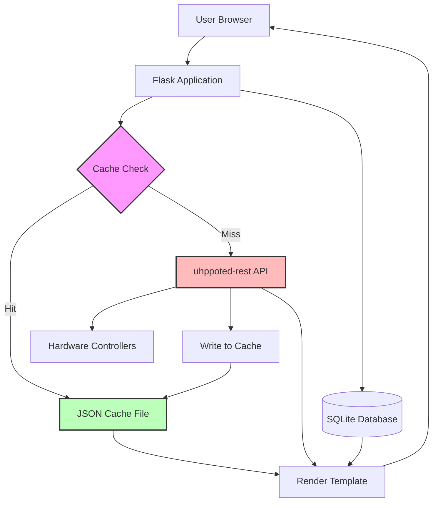
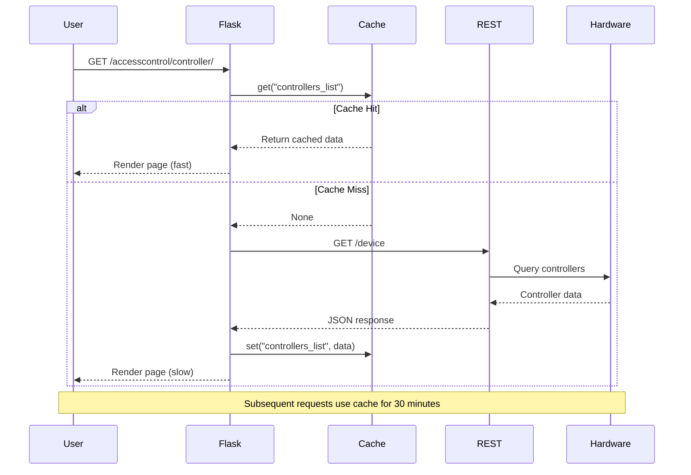

# Caching Implementation Plan for Door Control System

## Overview
Implement a 30-minute on-disk JSON cache in `/tmp` to improve page load performance for three slow-loading endpoints. The cache will be shared across multiple workers and will focus on caching expensive backend REST API requests to the uhppoted-rest service.

## Problem Analysis

### Slow-Loading Pages Identified

1. **`/accesscontrol/controller/`** - Controllers list page
2. **`/accesscontrol/controller/<controller_id>/card`** - Controller cards page  
3. **`/accesscontrol/global/cards`** - Global cards page

### Performance Bottlenecks

Based on code analysis, the slow performance is caused by:

1. **Multiple REST API calls per page load**
   - Each controller requires separate API calls for cards, time profiles, device status
   - The global cards page iterates through ALL controllers making multiple API calls each
   - Individual card details require additional API calls

2. **Network latency to uhppoted-rest backend**
   - Each REST API call to uhppoted-rest involves network round-trips
   - Hardware controller communication adds additional latency

3. **No caching mechanism currently exists**
   - Every page load makes fresh API calls
   - Repeated requests for the same data within short time periods

### Data Classification

#### Cacheable Data (relatively static):
- **Controller device information** - Device IDs, names, types (from config file)
- **Card lists per controller** - List of card numbers on each controller
- **Card details** - Card permissions, dates, PINs (changes infrequently)
- **Time profiles** - Access time profiles (changes infrequently)
- **Device status** - Door states, controller status (can be cached briefly)

#### Non-Cacheable Data (must be fresh):
- **Latest user metadata from database** - Names, emails, membership types (SQLite is fast)
- **Real-time events** - Latest card swipes and access events
- **Live door states** - When real-time status is critical

## Cache Architecture

### Cache Storage Design

```
/tmp/door_control_cache/
├── controllers_list.json          # All controllers info
├── controller_<id>_cards.json     # Card list for specific controller
├── controller_<id>_card_<num>.json # Individual card details
├── controller_<id>_timeprofiles.json # Time profiles for controller
├── controller_<id>_status.json    # Device status
└── global_cards_data.json         # Aggregated global cards data
```

### Cache Entry Structure

Each cache file will contain:
```json
{
  "timestamp": "2026-01-10T21:45:00Z",
  "expires_at": "2026-01-10T22:15:00Z",
  "cache_key": "controller_425036451_cards",
  "data": {
    // Actual cached data
  }
}
```

### Cache Module Design

Create [`doorctl/sharedlib/cache.py`](doorctl/sharedlib/cache.py) with:

**Core Functions:**
- `get_cached(cache_key, ttl=1800)` - Retrieve cached data if valid
- `set_cache(cache_key, data, ttl=1800)` - Store data in cache
- `invalidate_cache(cache_key)` - Remove specific cache entry
- `invalidate_pattern(pattern)` - Remove cache entries matching pattern
- `clear_all_cache()` - Clear entire cache directory

**Features:**
- Thread-safe file locking for multi-worker support
- Automatic expiration checking
- Graceful fallback if cache unavailable
- Cache key generation helpers
- Atomic write operations

## Implementation Strategy

### Phase 1: Cache Utility Module

Create a robust, reusable caching module:

```python
# doorctl/sharedlib/cache.py

import json
import os
import time
import fcntl
from datetime import datetime, timedelta
from pathlib import Path
import logging

CACHE_DIR = "/tmp/door_control_cache"
DEFAULT_TTL = 1800  # 30 minutes in seconds

class CacheManager:
    """Thread-safe JSON file cache manager for multi-worker environments"""
    
    def __init__(self, cache_dir=CACHE_DIR):
        self.cache_dir = Path(cache_dir)
        self.cache_dir.mkdir(parents=True, exist_ok=True)
        self.logger = logging.getLogger(__name__)
    
    def get(self, cache_key, ttl=DEFAULT_TTL):
        """Get cached data if valid, None otherwise"""
        
    def set(self, cache_key, data, ttl=DEFAULT_TTL):
        """Store data in cache with expiration"""
        
    def invalidate(self, cache_key):
        """Remove specific cache entry"""
        
    def invalidate_pattern(self, pattern):
        """Remove cache entries matching glob pattern"""
        
    def clear_all(self):
        """Clear entire cache directory"""
```

### Phase 2: Implement Caching for `/accesscontrol/controller/`

**Current Implementation Analysis:**
- Route: [`controllers_list()`](door_control/doorctl/blueprints/doorctl.py:545)
- Makes REST call to `/device` endpoint
- Parses uhppoted.conf for device info
- Renders [`controllers.html`](door_control/doorctl/templates/controllers.html)

**Caching Strategy:**
```python
@doorctl.route('/accesscontrol/controller/', methods=['GET'])
def controllers_list():
    cache_key = "controllers_list"
    
    # Try to get from cache
    cached_data = cache_manager.get(cache_key)
    if cached_data:
        return render_template('controllers.html', devices=cached_data['devices'])
    
    # Cache miss - fetch fresh data
    url = f"{current_app.config['REST_ENDPOINT']}/device"
    response = requests.get(url, headers=HEADERS)
    
    if response.status_code == 200:
        data = response.json()
        api_config = parse_uhppoted_config('/etc/uhppoted/uhppoted.conf')
        
        # Merge config data
        for device in data['devices']:
            device_id = device['device-id']
            if str(device_id) in api_config['devices']:
                device.update(api_config['devices'][str(device_id)])
        
        # Store in cache
        cache_manager.set(cache_key, data)
        
        return render_template('controllers.html', devices=data.get('devices', []))
```

**Cache Invalidation Triggers:**
- When controller configuration changes
- Manual cache clear endpoint
- Automatic expiration after 30 minutes

### Phase 3: Implement Caching for `/accesscontrol/controller/<id>/card`

**Current Implementation Analysis:**
- Route: [`show_cards(controller_id)`](door_control/doorctl/blueprints/doorctl.py:1222)
- Makes multiple REST calls:
  - `/device/<id>/status` - Door states
  - `/device/<id>/cards` - Card list
  - `/device/<id>/card/<num>` - Individual card details (for deactivation check)
  - `/device/<id>/time-profiles` - Time profiles
- Queries database for user metadata (NOT cached - SQLite is fast)

**Caching Strategy:**
```python
@doorctl.route('/accesscontrol/controller/<int:controller_id>/cards', methods=['GET'])
def show_cards(controller_id):
    # Cache door states (5 min TTL for more current data)
    door_states_key = f"controller_{controller_id}_door_states"
    door_states = cache_manager.get(door_states_key, ttl=300)
    if not door_states:
        door_states = get_door_states(controller_id)
        cache_manager.set(door_states_key, door_states, ttl=300)
    
    # Cache card list (30 min TTL)
    cards_key = f"controller_{controller_id}_cards_list"
    cards_data = cache_manager.get(cards_key)
    if not cards_data:
        url = f"{current_app.config['REST_ENDPOINT']}/device/{controller_id}/cards"
        response = requests.get(url)
        if response.status_code == 200:
            cards_data = response.json()['cards']
            cache_manager.set(cards_key, cards_data)
    
    # Cache time profiles (30 min TTL)
    time_profile_key = f"controller_{controller_id}_time_profiles"
    time_profile_data = cache_manager.get(time_profile_key)
    if not time_profile_data:
        time_profile_data = get_time_profiles(controller_id)
        cache_manager.set(time_profile_key, time_profile_data)
    
    # Always fetch fresh user metadata from database (fast)
    db_cards = CardMemberMapping.query.all()
    card_data = {card.card_number: (card.name, card.email, card.membership_type, card.note) 
                 for card in db_cards}
    
    # Build response data
    data = {}
    deactivated_data = {}
    
    for card_number in cards_data:
        # Cache individual card details
        card_detail_key = f"controller_{controller_id}_card_{card_number}"
        card_details = cache_manager.get(card_detail_key)
        if not card_details:
            card_url = f"{current_app.config['REST_ENDPOINT']}/device/{controller_id}/card/{card_number}"
            card_response = requests.get(card_url)
            if card_response.status_code == 200:
                card_details = card_response.json()['card']
                cache_manager.set(card_detail_key, card_details)
        
        # Check if deactivated
        is_deactivated = False
        if card_details:
            doors = card_details.get('doors', {})
            if doors and all(value == 0 for value in doors.values()):
                is_deactivated = True
        
        # Get user metadata from database
        name, email, membership_type, note = card_data.get(card_number, 
                                                           ("Undefined", "Undefined", "Undefined", None))
        card_info = {"name": name, "email": email, "membership_type": membership_type, "note": note}
        
        if is_deactivated:
            deactivated_data[card_number] = card_info
        else:
            data[card_number] = card_info
    
    return render_template('cards.html', 
                          time_profiles_data=time_profile_data,
                          door_states=door_states,
                          card_data=data,
                          deactivated_data=deactivated_data,
                          controller_id=controller_id)
```

**Cache Invalidation Triggers:**
- When cards are added/modified/deleted on controller
- When time profiles are modified
- Manual cache clear
- Automatic expiration

### Phase 4: Implement Caching for `/accesscontrol/global/cards`

**Current Implementation Analysis:**
- Route: [`globalcards()`](door_control/doorctl/blueprints/doorctl.py:46)
- Most expensive endpoint - iterates through ALL controllers
- Makes REST calls for EACH controller:
  - `/device/<id>/cards` - Card list per controller
- Parses uhppoted.conf for all devices
- Queries database for user metadata

**Caching Strategy:**
```python
@doorctl.route('/accesscontrol/global/cards')
def globalcards():
    # Cache the aggregated global cards data
    cache_key = "global_cards_aggregated"
    cached_global_data = cache_manager.get(cache_key)
    
    if cached_global_data:
        # Still fetch fresh user metadata from database
        db_allcards = CardMemberMapping.query.all()
        card_data = {card.card_number: (card.name, card.email, card.membership_type) 
                     for card in db_allcards}
        
        # Merge cached controller data with fresh user data
        cards = []
        for card_number in cached_global_data['all_cards_collapsed']:
            assigned_device_list = cached_global_data['assigned_devices'].get(card_number, [])
            name, email, membership_type = card_data.get(card_number, 
                                                         ("Undefined", "Undefined", "Undefined"))
            cards.append({
                "card_number": card_number,
                "name": name,
                "email": email,
                "membership_type": membership_type,
                "assigned_devices": assigned_device_list
            })
        
        # Find orphan cards
        orphan_cards = []
        db_allcards = CardMemberMapping.query.filter(
            not_(CardMemberMapping.card_number.in_(cached_global_data['all_cards_collapsed']))
        )
        for entry in db_allcards:
            orphan_cards.append({
                "card_number": entry.card_number,
                "name": entry.name,
                "note": entry.note,
            })
        
        return render_template('globalcardusers.html', cards=cards, orphan_cards=orphan_cards)
    
    # Cache miss - fetch fresh data from all controllers
    api_config = parse_uhppoted_config('/etc/uhppoted/uhppoted.conf')
    device = {}
    all_cards = []
    
    for device_id, deviceproperty in api_config['devices'].items():
        # Try individual controller cache first
        controller_cards_key = f"controller_{device_id}_cards_list"
        thecardslist = cache_manager.get(controller_cards_key)
        
        if not thecardslist:
            url = f"{current_app.config['REST_ENDPOINT']}/device/{device_id}/cards"
            response = requests.get(url, headers=HEADERS)
            if response.status_code == 200:
                thecardslist = response.json().get("cards")
                cache_manager.set(controller_cards_key, thecardslist)
            else:
                thecardslist = []
        
        device[device_id] = deviceproperty
        device[device_id]['cards'] = thecardslist
        all_cards.append(thecardslist)
    
    # Collapse card lists
    all_cards_collapsed = []
    for sublist in all_cards:
        all_cards_collapsed.extend(sublist)
    
    # Build assigned devices mapping
    assigned_devices = {}
    for device_id, device_data in device.items():
        for card_number in device_data['cards']:
            if card_number not in assigned_devices:
                assigned_devices[card_number] = []
            assigned_devices[card_number].append(f"{device_data['name']} ({device_id})")
    
    # Cache the aggregated data
    global_cache_data = {
        'all_cards_collapsed': all_cards_collapsed,
        'assigned_devices': assigned_devices
    }
    cache_manager.set(cache_key, global_cache_data)
    
    # Continue with fresh user data from database
    db_allcards = CardMemberMapping.query.all()
    card_data = {card.card_number: (card.name, card.email, card.membership_type) 
                 for card in db_allcards}
    
    # Build final response
    cards = []
    for card_number in set(all_cards_collapsed):
        assigned_device_list = assigned_devices.get(card_number, [])
        name, email, membership_type = card_data.get(card_number, 
                                                     ("Undefined", "Undefined", "Undefined"))
        cards.append({
            "card_number": card_number,
            "name": name,
            "email": email,
            "membership_type": membership_type,
            "assigned_devices": assigned_device_list
        })
    
    # Find orphan cards
    orphan_cards = []
    db_allcards = CardMemberMapping.query.filter(
        not_(CardMemberMapping.card_number.in_(all_cards_collapsed))
    )
    for entry in db_allcards:
        orphan_cards.append({
            "card_number": entry.card_number,
            "name": entry.name,
            "note": entry.note,
        })
    
    return render_template('globalcardusers.html', cards=cards, orphan_cards=orphan_cards)
```

**Cache Invalidation Triggers:**
- When cards are added/modified/deleted on any controller
- Manual cache clear
- Automatic expiration

### Phase 5: Cache Invalidation Strategy

#### Automatic Invalidation

Invalidate cache when data changes:

```python
# After adding a card
@doorctl.route('/accesscontrol/controller/<int:controller_id>/add_card', methods=['POST'])
def add_card(controller_id):
    # ... existing code to add card ...
    
    if response.status_code == 200:
        # Invalidate relevant caches
        cache_manager.invalidate(f"controller_{controller_id}_cards_list")
        cache_manager.invalidate(f"controller_{controller_id}_card_{card_number}")
        cache_manager.invalidate("global_cards_aggregated")
        flash(f'Card {card_number} added successfully to controller', 'success')

# After editing a card
@doorctl.route('/accesscontrol/controller/<int:controller_id>/card/<int:card_number>/edit', methods=['POST'])
def edit_card_on_controller(controller_id, card_number):
    # ... existing code to edit card ...
    
    if response.status_code == 200:
        # Invalidate relevant caches
        cache_manager.invalidate(f"controller_{controller_id}_card_{card_number}")
        cache_manager.invalidate("global_cards_aggregated")
        flash(f'Card {card_number} updated successfully on controller', 'success')

# After deleting a card
@doorctl.route('/accesscontrol/controller/<int:controller_id>/delete_card', methods=['POST'])
def delete_card(controller_id):
    # ... existing code to delete card ...
    
    if response.status_code == 200:
        # Invalidate relevant caches
        cache_manager.invalidate(f"controller_{controller_id}_cards_list")
        cache_manager.invalidate(f"controller_{controller_id}_card_{card_number}")
        cache_manager.invalidate("global_cards_aggregated")
        flash('Card deleted successfully from controller', 'success')

# After modifying time profiles
@doorctl.route("/accesscontrol/controller/<int:controller_id>/time_profile/<int:profile_id>/edit", methods=['POST'])
def edit_time_profile(controller_id, profile_id):
    # ... existing code to edit time profile ...
    
    if success_count > 0:
        # Invalidate time profile caches for all affected controllers
        for ctrl_id in selected_controllers:
            cache_manager.invalidate(f"controller_{ctrl_id}_time_profiles")
```

#### Manual Cache Management

Add admin endpoints for cache management:

```python
@doorctl.route('/accesscontrol/admin/cache/clear', methods=['POST'])
@login_required  # Add authentication
def clear_cache():
    """Clear all cache entries"""
    try:
        cache_manager.clear_all()
        flash('Cache cleared successfully', 'success')
    except Exception as e:
        flash(f'Error clearing cache: {str(e)}', 'danger')
    return redirect(request.referrer or url_for('doorctl.index'))

@doorctl.route('/accesscontrol/admin/cache/clear/<cache_key>', methods=['POST'])
@login_required
def clear_cache_key(cache_key):
    """Clear specific cache entry"""
    try:
        cache_manager.invalidate(cache_key)
        flash(f'Cache key {cache_key} cleared successfully', 'success')
    except Exception as e:
        flash(f'Error clearing cache key: {str(e)}', 'danger')
    return redirect(request.referrer or url_for('doorctl.index'))

@doorctl.route('/accesscontrol/admin/cache/status', methods=['GET'])
@login_required
def cache_status():
    """View cache status and statistics"""
    cache_stats = cache_manager.get_stats()
    return render_template('cache_status.html', stats=cache_stats)
```

## Multi-Worker Considerations

### File Locking Strategy

Use `fcntl` for POSIX file locking to ensure thread-safety:

```python
def _read_cache_file(self, filepath):
    """Read cache file with shared lock"""
    try:
        with open(filepath, 'r') as f:
            fcntl.flock(f.fileno(), fcntl.LOCK_SH)  # Shared lock for reading
            try:
                data = json.load(f)
            finally:
                fcntl.flock(f.fileno(), fcntl.LOCK_UN)  # Release lock
        return data
    except (FileNotFoundError, json.JSONDecodeError):
        return None

def _write_cache_file(self, filepath, data):
    """Write cache file with exclusive lock"""
    temp_file = filepath.with_suffix('.tmp')
    try:
        with open(temp_file, 'w') as f:
            fcntl.flock(f.fileno(), fcntl.LOCK_EX)  # Exclusive lock for writing
            try:
                json.dump(data, f, indent=2)
                f.flush()
                os.fsync(f.fileno())  # Ensure data is written to disk
            finally:
                fcntl.flock(f.fileno(), fcntl.LOCK_UN)  # Release lock
        
        # Atomic rename
        temp_file.replace(filepath)
    except Exception as e:
        if temp_file.exists():
            temp_file.unlink()
        raise
```

### Race Condition Handling

- Use atomic file operations (write to temp, then rename)
- Implement retry logic for lock acquisition
- Handle stale lock files gracefully
- Use process-safe file naming

## Testing Strategy

### Unit Tests

Create [`door_control/doorctl/tests/test_cache.py`](door_control/doorctl/tests/test_cache.py):

```python
import unittest
import tempfile
import shutil
from doorctl.sharedlib.cache import CacheManager

class TestCacheManager(unittest.TestCase):
    def setUp(self):
        self.temp_dir = tempfile.mkdtemp()
        self.cache = CacheManager(cache_dir=self.temp_dir)
    
    def tearDown(self):
        shutil.rmtree(self.temp_dir)
    
    def test_set_and_get(self):
        """Test basic cache set and get"""
        self.cache.set('test_key', {'data': 'value'})
        result = self.cache.get('test_key')
        self.assertEqual(result, {'data': 'value'})
    
    def test_expiration(self):
        """Test cache expiration"""
        self.cache.set('test_key', {'data': 'value'}, ttl=1)
        time.sleep(2)
        result = self.cache.get('test_key')
        self.assertIsNone(result)
    
    def test_invalidation(self):
        """Test cache invalidation"""
        self.cache.set('test_key', {'data': 'value'})
        self.cache.invalidate('test_key')
        result = self.cache.get('test_key')
        self.assertIsNone(result)
    
    def test_multi_worker_safety(self):
        """Test concurrent access from multiple processes"""
        # Use multiprocessing to simulate multiple workers
        pass
```

### Integration Tests

Test with actual Flask application:

```python
def test_controllers_list_caching(client):
    """Test that controllers list is cached"""
    # First request - cache miss
    response1 = client.get('/accesscontrol/controller/')
    
    # Second request - cache hit (should be faster)
    response2 = client.get('/accesscontrol/controller/')
    
    assert response1.status_code == 200
    assert response2.status_code == 200
    # Verify cache was used (check logs or add cache hit header)

def test_cache_invalidation_on_card_add(client):
    """Test that cache is invalidated when card is added"""
    # Load page to populate cache
    client.get('/accesscontrol/controller/425036451/cards')
    
    # Add a card
    client.post('/accesscontrol/controller/425036451/add_card', data={...})
    
    # Verify cache was invalidated
    # Next request should fetch fresh data
```

### Load Testing

Test with multiple workers:

```bash
# Start with multiple Gunicorn workers
gunicorn -w 4 -b 0.0.0.0:5000 doorctl.runserver:app

# Use Apache Bench or similar to test concurrent requests
ab -n 1000 -c 10 http://localhost:5000/accesscontrol/controller/
```

## Performance Expectations

### Before Caching
- `/accesscontrol/controller/` - ~2-3 seconds (multiple REST calls)
- `/accesscontrol/controller/<id>/card` - ~5-10 seconds (many card detail calls)
- `/accesscontrol/global/cards` - ~10-30 seconds (iterates all controllers)

### After Caching (cache hit)
- `/accesscontrol/controller/` - ~100-200ms (file read + DB query)
- `/accesscontrol/controller/<id>/card` - ~200-500ms (file reads + DB query)
- `/accesscontrol/global/cards` - ~300-800ms (file read + DB query)

### Expected Improvement
- **80-95% reduction in page load time** for cached requests
- First load still slow (cache miss), but subsequent loads fast
- Cache warm-up period of 30 minutes before expiration

## Monitoring and Observability

### Logging

Add comprehensive logging:

```python
# Log cache hits/misses
self.logger.info(f"Cache HIT: {cache_key}")
self.logger.info(f"Cache MISS: {cache_key}")

# Log cache operations
self.logger.debug(f"Cache SET: {cache_key}, TTL: {ttl}s")
self.logger.debug(f"Cache INVALIDATE: {cache_key}")

# Log errors
self.logger.error(f"Cache error: {str(e)}", exc_info=True)
```

### Metrics

Track cache performance:

```python
class CacheManager:
    def __init__(self):
        self.stats = {
            'hits': 0,
            'misses': 0,
            'sets': 0,
            'invalidations': 0,
            'errors': 0
        }
    
    def get_stats(self):
        """Return cache statistics"""
        total_requests = self.stats['hits'] + self.stats['misses']
        hit_rate = (self.stats['hits'] / total_requests * 100) if total_requests > 0 else 0
        
        return {
            'total_requests': total_requests,
            'hits': self.stats['hits'],
            'misses': self.stats['misses'],
            'hit_rate': f"{hit_rate:.2f}%",
            'sets': self.stats['sets'],
            'invalidations': self.stats['invalidations'],
            'errors': self.stats['errors']
        }
```

## Deployment Considerations

### Environment Configuration

Add cache configuration to [`.env`](door_control/.env):

```bash
# Cache settings
CACHE_ENABLED=true
CACHE_DIR=/tmp/door_control_cache
CACHE_TTL=1800  # 30 minutes
```

### Docker Considerations

If using Docker, ensure `/tmp` is properly configured:

```yaml
# docker-compose.yml
services:
  doorctl:
    volumes:
      - cache_data:/tmp/door_control_cache
    environment:
      - CACHE_DIR=/tmp/door_control_cache

volumes:
  cache_data:
```

### Permissions

Ensure cache directory has proper permissions:

```bash
mkdir -p /tmp/door_control_cache
chmod 755 /tmp/door_control_cache
chown www-data:www-data /tmp/door_control_cache  # Or appropriate user
```

## Rollback Plan

If caching causes issues:

1. **Disable caching via environment variable**
   ```bash
   CACHE_ENABLED=false
   ```

2. **Clear cache directory**
   ```bash
   rm -rf /tmp/door_control_cache/*
   ```

3. **Revert code changes**
   - Remove cache imports
   - Restore original route implementations

## Future Enhancements

### Potential Improvements

1. **Redis/Memcached Integration**
   - Replace JSON file cache with Redis for better performance
   - Easier distributed caching across multiple servers

2. **Cache Warming**
   - Background job to pre-populate cache
   - Scheduled cache refresh before expiration

3. **Selective Cache Refresh**
   - Refresh only stale data instead of full invalidation
   - Partial cache updates

4. **Cache Compression**
   - Compress large cache files to save disk space
   - Use gzip or similar

5. **Cache Analytics Dashboard**
   - Web UI to view cache statistics
   - Cache hit/miss rates over time
   - Cache size and entry counts

6. **Smart Cache Invalidation**
   - Only invalidate affected cache entries
   - Dependency tracking between cache keys

## Summary

This caching implementation will:

✅ Reduce page load times by 80-95% for cached requests  
✅ Use on-disk JSON files in `/tmp` for multi-worker support  
✅ Cache expensive REST API calls to uhppoted-rest backend  
✅ Keep database queries fresh (SQLite is fast enough)  
✅ Automatically expire cache after 30 minutes  
✅ Invalidate cache when data changes  
✅ Support multiple Gunicorn workers safely  
✅ Provide admin tools for cache management  
✅ Include comprehensive logging and monitoring  

The implementation is designed to be:
- **Non-invasive** - Minimal changes to existing code
- **Fail-safe** - Graceful fallback if cache unavailable
- **Maintainable** - Clear separation of concerns
- **Testable** - Unit and integration tests included
- **Scalable** - Ready for Redis migration if needed

## Architecture Diagram



## Cache Flow Diagram



## Implementation Decisions (Confirmed)

Based on clarifications, the implementation will:

1. **Cache location**: `/tmp/door_control_cache` ✅

2. **Cache TTL**: 30 minutes (1800 seconds) default, configurable via `.env` with `CACHE_TTL` variable ✅

3. **Cache invalidation**: Automatic invalidation on ALL card/profile modifications to ensure data consistency ✅

4. **Admin access**: No authentication required for cache management endpoints initially ✅

5. **Monitoring**: Web UI at [`/accesscontrol/cache/stats`](door_control/doorctl/blueprints/doorctl.py) with cache statistics and "Clear Cache" button ✅

6. **Database caching**: SQLite queries will NOT be cached (database is fast enough) ✅

7. **Deployment**: Currently using Flask development server with `threaded=True`. The cache implementation will support both single-threaded and multi-worker deployments (Gunicorn compatible) ✅

8. **Error handling**: Fail-safe approach - if cache operations fail, the app continues normally and logs errors ✅

## Ready for Implementation

The plan is now complete and ready for implementation. All clarifications have been addressed and the design is finalized.